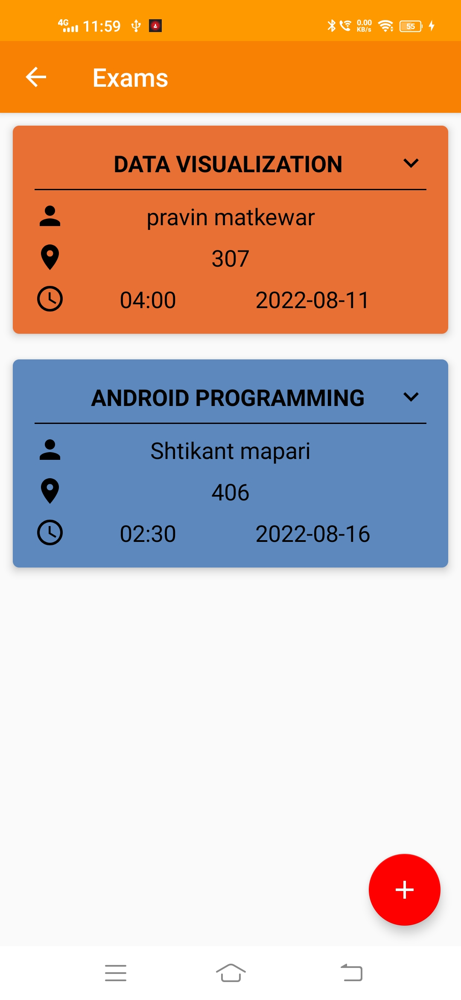
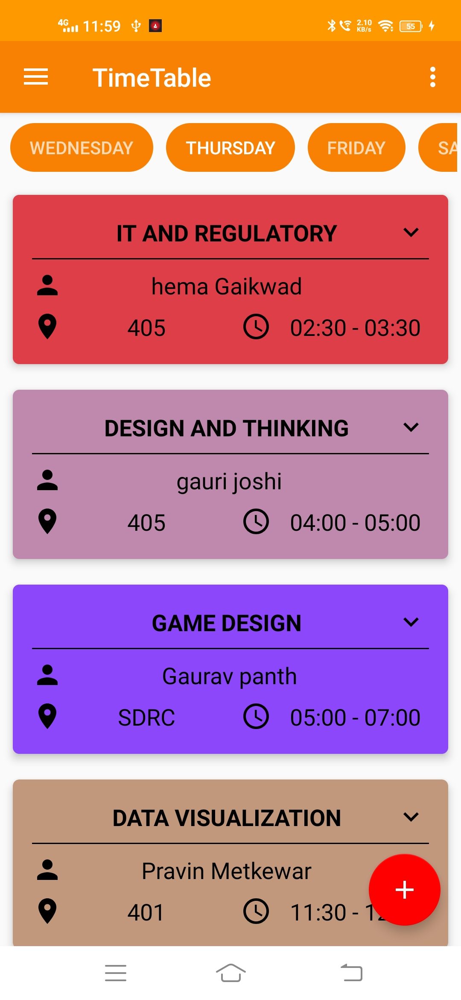
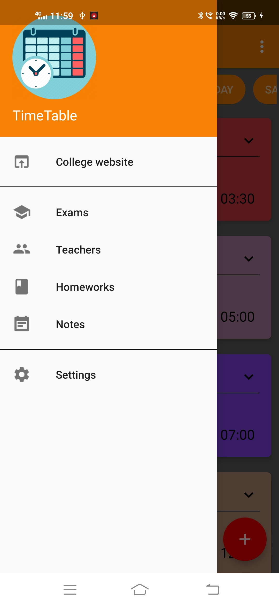
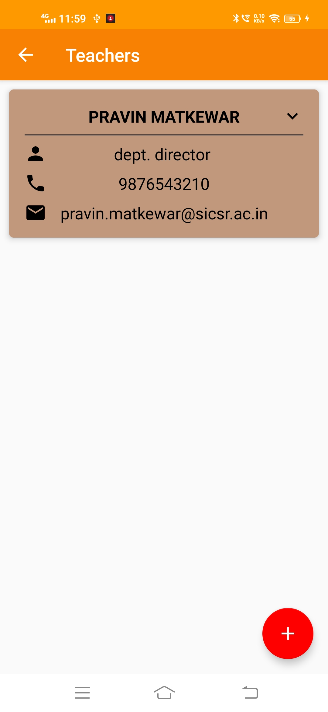
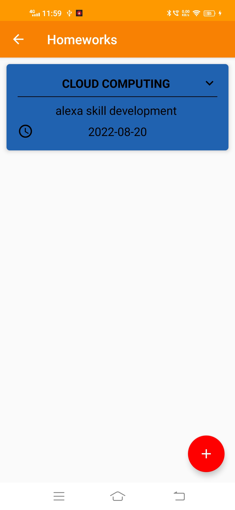
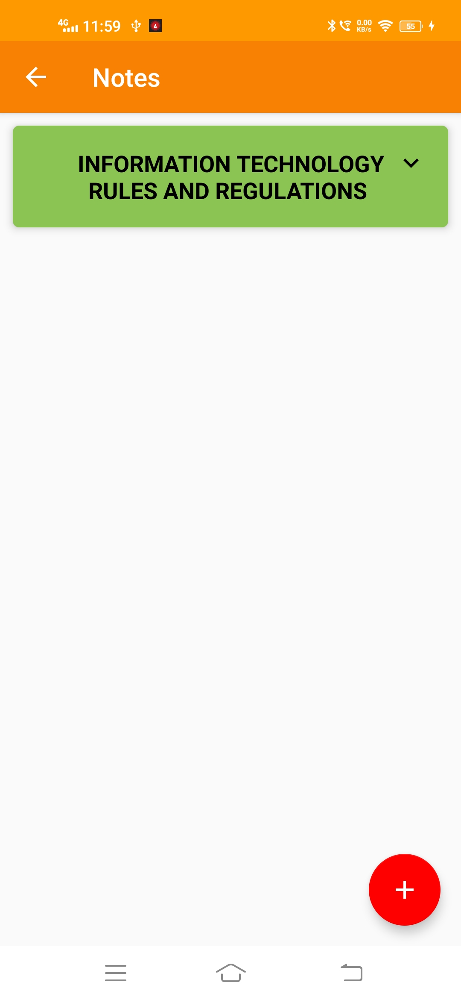
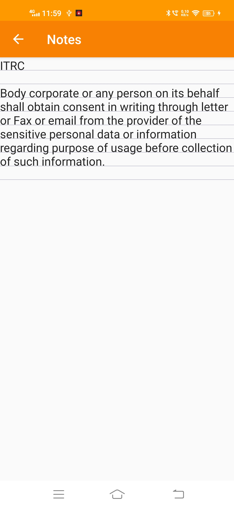
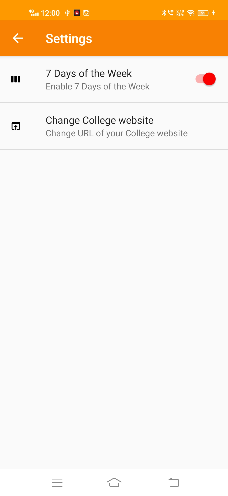
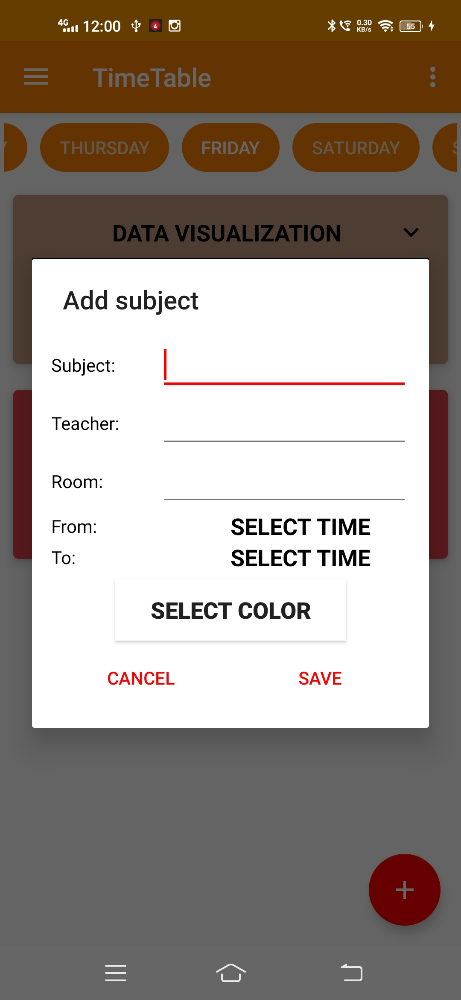

<B> Download the APK file [APK file](https://github.com/Killmonger007/Student-schedule-management-app/blob/master/app-debug.apk)</B>

# TimeTable
<h1 align=center>

</h1>

Download the APK file [APK file](https://github.com/Killmonger007/Student-schedule-management-app/blob/master/app-debug.apk)
### Contribute
 #time-table-in-android-java-for-students
timetable & management app for students created in android   

i upgraded the timetable app created by [@ulan](https://github.com/ulan17/) to a more stable & colorful application   
you can not only add timetable for your lectures but can also add examination schedule, teachers details, home works with submission dates, you can also store notes   
You can also add your school/college website for easy access 

Download the APK file [APK file](https://github.com/Killmonger007/Student-schedule-management-app/blob/master/app-debug.apk)

### Screenshots
 &nbsp;&nbsp;&nbsp;&nbsp;
 &nbsp;&nbsp;&nbsp;&nbsp; 
 &nbsp;&nbsp;&nbsp;&nbsp;   
 &nbsp;&nbsp;&nbsp;&nbsp;
 &nbsp;&nbsp;&nbsp;&nbsp;
 &nbsp;&nbsp;&nbsp;&nbsp;   
 &nbsp;&nbsp;&nbsp;&nbsp;
 &nbsp;&nbsp;&nbsp;&nbsp;
 &nbsp;&nbsp;&nbsp;&nbsp;   

### Licence

The source code is licensed under the [GNU v3 Public License](https://github.com/ulan17/TimeTable/blob/master/LICENSE). 

Download the APK file [APK file](https://github.com/Killmonger007/Student-schedule-management-app/blob/master/app-debug.apk)
